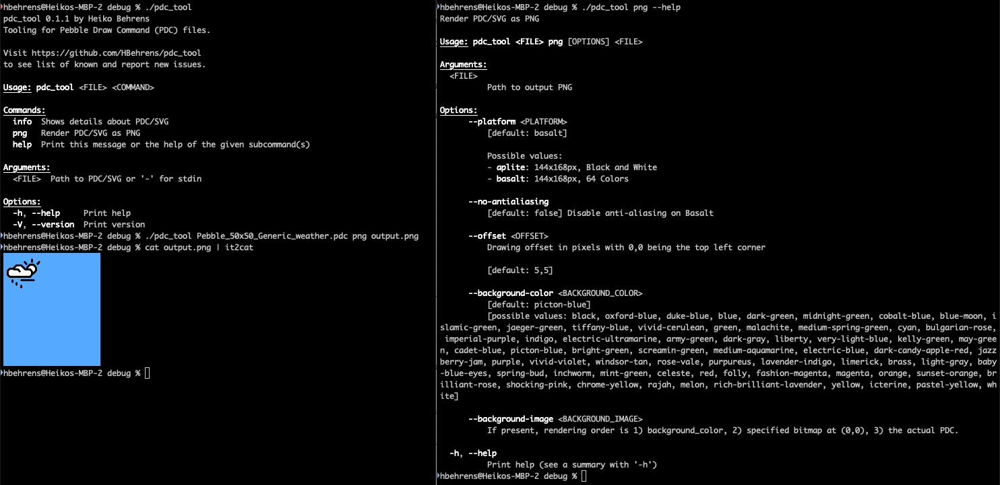

# pdc_tool

A command-line interface for working with Pebble Draw Command (PDC) files. With `pdc_tool`, you can:
  - Convert SVGs to PDCs,
  - Render PDCs as PNGs,
  - Render SVGs directly to PNGs,

producing **pixel-perfect** output identical to how the original Pebble (1-bit B&W) or Pebble Time (64 colors) will display a given vector drawing.



> [!NOTE]
> This is an early version with known limitations. While this tool should not cause any harm, it may fail in (un-)expected ways.

### 📥 Download

Download the platform-specific binary from [pdc_tool/releases](https://github.com/HBehrens/pdc_tool/releases).

## 🔮 Future Plans
* [x] Introduce command `pdc` to actually save a PDC.
* [x] Emit diagnostics during conversion.
* [ ] Provide examples (SVGs and commands to run).
* [ ] Command `svg` to produce annotated output (embedded diagnostics).
* [x] Support Bézier curves and `<circle>` elements.
* [ ] Open-Source (Rust) `svg_tool` and its `pdc` command (excluding `png`, as it depends on Gossan).

## 🛑 Running on macOS
If you see the message:

> **"Apple could not verify 'pdc_tool' is free of malware that may harm your Mac or compromise your privacy."**

You can either:
1. Click the `(?)` icon in the dialog and follow Apple's instructions, or  
2. Remove the quarantine flag via the terminal:

```sh
xattr -d com.apple.quarantine ~/Downloads/pdc_tool
```


## ❓FAQ

### Who is this tool for?

While discussing https://github.com/pebble-dev/iconography/ with [@lavglaab](https://github.com/lavglaab), we realized that **graphic designers** had only limited tools to verify their work. `pdc_tool` bridges that gap by rendering vector graphics *exactly*(!) like Pebble, pixel-perfectly down to every single bug. You can run `pdc_tool input.svg png output.png` and optionally choose from various options from color depth (b&w vs. 64 colors), background color, and anti-aliasing. The result is a 144x168px PNG that matches what Pebble will render, down to the last bit.

### How does this tool achieve pixel-perfect results?

Under the hood, `pdc_tool` uses a [cleanroom re-implementation](https://en.wikipedia.org/wiki/Clean-room_design) of the **Pebble application runtime in Rust called "Gossan"**. Developed over several years in [@HBehrens](https://github.com/HBehrens)'s spare time, Gossan manages a framebuffer and provides Pebble's drawing routines (and much more that's irrelevant in this context) when rendering Pebble Draw Commands (PDC). It is extensively tested against Pebble's actual firmware to validate the same behavior between Pebble and Gossan or document any discrepancies. Since [the Pebble firmware is now open-source](https://opensource.googleblog.com/2025/01/see-code-that-powered-pebble-smartwatches.html), a few remaining edge-cases (pun intended) could be fixed!

### Why is there no source code?

The main priority was quickly enable graphic designers to contribute to https://github.com/pebble-dev/iconography/ with high confidence. The source of `pdc_tool` is **entangled with Gossan** (see above) and lives in Gossan's private repository. The plan is to restructure it and to open-source at least the conversion from SVG→PDC. That way, folks can understand (and help improving) the PDC generation. It will also allow for use-cases where open-source is critical (i.e. as an alterative to [svg2pdc.py](https://github.com/pebble-dev/pebble-firmware/tree/588a44eb6d72a5eda3471586aaa9df699b255b90/tools/svg2png)).
